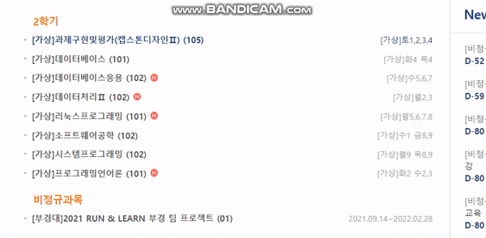
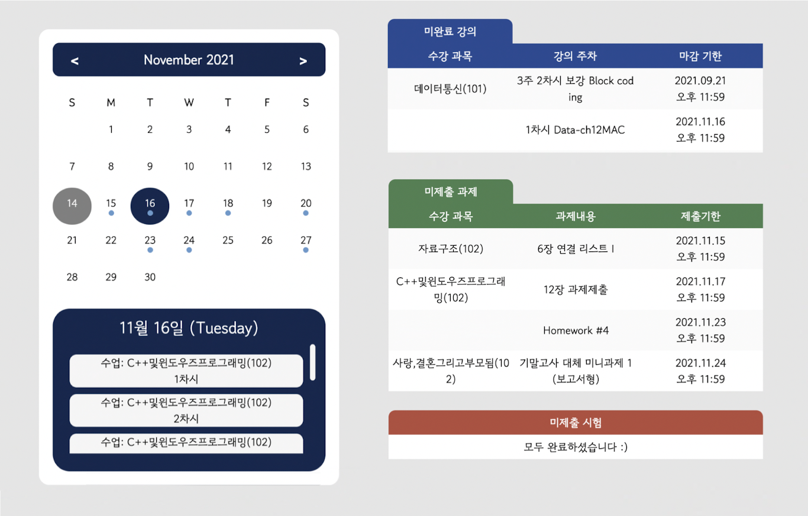

<h1>Hello, This Project is PKSELECT</h1>
pkselect란? 기존의 LMS서비스보다 편리하게 미제출 항목를 조회할 수 있도록 돕는 웹사이트  
<ul> 이런 경험 있지 않나요?</ul> 

  

  

<h2> 로그인만하세요 </h2>
<ul> &middot; 캘린더의 날짜 선택 시 해당 날이 마감일인 미제출 항목을 확인할 수 있어요</ul>
<ul> &middot; 테이블을 통해 마감기한이 임박한 순으로 미제출된 강의, 과제, 시험 별로 확인할 수 있어요 </ul>

   
<h2> 어떻게 만들었나요? </h2>
<ul>
    컴퓨터공학과 4명에서 만들었어요. 비대면이 끝나면 이 프로젝트도 사라지겠지만 그 전에 열심히 해볼게요 !
</ul>
 
</a> </a>&nbsp </a> </a>&nbsp

   

<h2> 개인정보가 유출 되나요? </h2>
<ul>
    https로 네트워크시 전달되는 데이터가 암호화되어져요 ! 그리고 저희는 DB에 저장하지 않고 단순히 조회만 하고 끝내요 !
</ul>
  

<h2> Document </h2>
<ul>
	&middot;
    <a href="https://doongu.gitbook.io/pk_select/">PKSELECT Gitbook </a>
</ul>
  

<h2> Team Information </h2>

<!--  아래는 Team INFORMATION 표-->

Team|Name|Position|E-Mail|Github|
---|---|---|---|---|
Leader|한준규|Project Manager, BackEnd Develope|must1080@naver.com|<a href="https://github.com/Haram0111">
Team|오하람|Project Sub Manager|5gkfka5@naver.com|<a href="https://github.com/Haram0111">
Team|이가은|Frontend Develope|rriver2@naver.com|<a href="https://github.com/rriver2">
Team|박민서|Frontend Develope|maphchbiea78@gmail.com|<a href="https://github.com/Verus0">